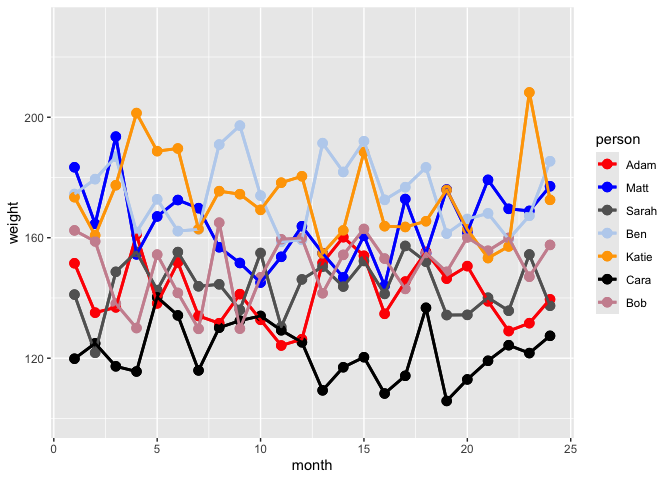

<!-- README.md is generated from README.Rmd. Please edit that file -->

# cbPalette

<!-- badges: start -->
<!-- badges: end -->

The goal of cbPalette is to make ggplot plots more readable for
colorblind people. It provides functions to assist with geom_point(),
geom_bar(), and other geom\_\* objects. The package replaces the default
color map by using scale_color_cb().

## Installation

You can install the development version of regexcite from
[GitHub](https://github.com/) with:

``` r
# install.packages("devtools")
devtools::install_github("hannahas/cbPalette")
```

## Usage

First, we create a data set that shows the weights of seven different
people as a function of month for 24 months. We give each person a name,
and randomly assign the weight within a range 120-180. We add some noise
to the data.

``` r
library(cbPalette)
library(ggplot2)
######################## Make data frame for plot ######################
# Set the seed for reproducibility
set.seed(123)

# Define the number of months
months <- 24
# Define person names
person_names <- c("Adam", "Matt", "Sarah", "Ben", "Katie", "Cara", "Bob")

# Create a data frame with repeating months and corresponding person names
df <- expand.grid(month = 1:months, person = person_names)

# Assign initial weights randomly within a realistic range, say 120 to 180 lbs
initial_weights <- runif(length(person_names), min = 120, max = 180)

# Map initial weights to persons
weights_map <- setNames(initial_weights, person_names)

# Assign base weight to each person
df$weight <- weights_map[as.character(df$person)]

# Apply a personal variation (~20%)
df$weight <- df$weight * (1 + runif(nrow(df), -0.1, 0.1))

# Apply monthly fluctuation (~10%)
monthly_fluctuation <- 0.1

# Modify weights per month to introduce mild fluctuations
for (i in 1:nrow(df)) {
  # Simulate monthly weight fluctuation
  fluctuation <- df$weight[i] * runif(1, -monthly_fluctuation, monthly_fluctuation)
  df$weight[i] <- df$weight[i] + fluctuation
}

# Convert 'person' column to a factor to make it categorical
df$person <- factor(df$person)
######################## Make data frame for plot ######################
```

Next, we create a ggplot object to show the weight as a function of
month. We add geom_point() and geom_line() to the plot object, where the
color of each is defined by the person. So each line with points
represents one person, and is a unique color. At first, we don’t specify
a color map, so it uses the default ggplot2 colors for seven categories.

``` r
######################## Make ggplot object ######################
plt <- ggplot(df, mapping = aes(x = month, y = weight)) +
  scale_y_continuous(limits = c(100, 230)) +
  geom_point(aes(color = person), size = 3) +
  geom_line(aes(color = person), linewidth = 1)
######################## Make ggplot object ######################
```

Now we print the plot as is. As a colorblind person, I have great
difficulty discerning these colors on the graph.

``` r
######################## Example plot with default ggplot colors ######################
print(plt)
```


``` r
######################## Example plot with default ggplot colors ######################
```

Now we create a different plot object from the orignal, adding a color
scale from the cbPalette package. We specify scale_color_cb(), using our
7 category colorblind-friendly palette. With this map, I can much more
easily discern the seven colors in the plot.

``` r
######################## testing: call them in the same way we would with any scale_*() function in {ggplot2}
cbPlot <- plt +
 geom_point(aes(colour = person), size = 3) +
  geom_line(aes(color = person), linewidth = 1) +
  scale_colour_cb()
#> [1] 7
print(cbPlot)
```



``` r
######################## testing: call them in the same way we would with any scale_*() function in {ggplot2}
```
